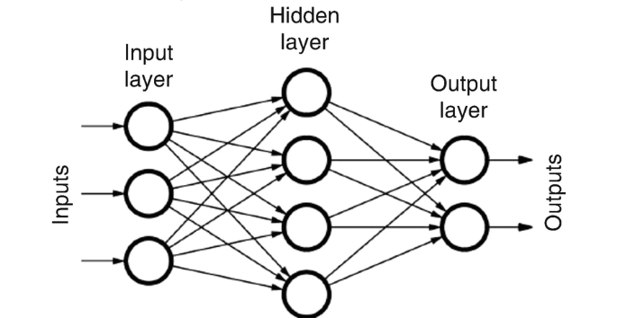
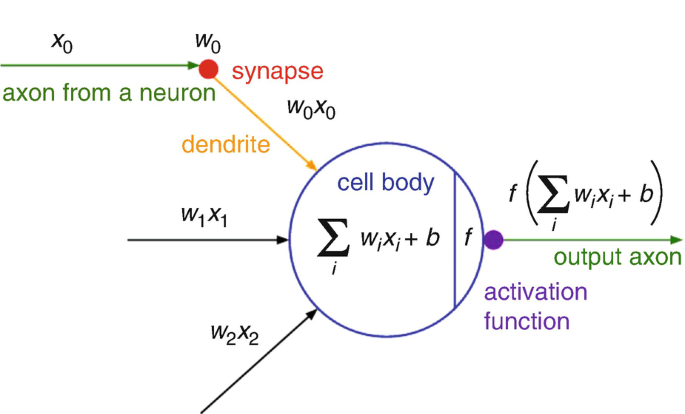

# ```Neural Networks from Scratch to Advanced in Python ```

Welcome to the Neural Networks from Scratch to Expert repository! This repository is designed to guide you through the journey of learning and implementing neural networks in Python, starting from the basics and progressing to advanced concepts. Whether you're a beginner looking to understand neural networks or an expert seeking to enhance your skills, this repository aims to provide comprehensive resources and examples.

> Artificial Neural Networks are a branch of machine learning models that are built using principles of neuronal organization discovered by connectionism in the biological neural networks constituting animal brains.


## Table of Contents

1. [Introduction to Neural Networks](#introduction-to-neural-networks)
2. [Getting Started](#getting-started)
    - [Prerequisites](#prerequisites)
    - [Installation](#installation)
3. [Basic Concepts](#basic-concepts)
    - [Understanding Neural Networks](#understanding-neural-networks)
    - [Building Blocks of Neural Networks](#building-blocks-of-neural-networks)
4. [Intermediate Concepts](#intermediate-concepts)
    - [Activation Functions](#activation-functions)
    - [Loss Functions](#loss-functions)
    - [Optimizers](#optimizers)
    - [Regularization Techniques](#regularization-techniques)
5. [Advanced Topics](#advanced-topics)
    - [Convolutional Neural Networks (CNNs)](#convolutional-neural-networks-cnns)
    - [Recurrent Neural Networks (RNNs)](#recurrent-neural-networks-rnns)
    - [Generative Adversarial Networks (GANs)](#generative-adversarial-networks-gans)
6. [Examples](#examples)
    - [Image Classification](#image-classification)
    - [Natural Language Processing](#natural-language-processing)
7. [Resources](#resources)
    - [Books](#books)
    - [Courses](#courses)
    - [Online Platforms](#online-platforms)
8. [Contributing](#contributing)
9. [License](#license)

## Introduction to Neural Networks

Neural networks are a class of machine learning models inspired by the structure and functioning of the human brain. They are capable of learning complex patterns and relationships from data, making them powerful tools for various tasks such as classification, regression, and generation.


Artificial Neural networks are made up of **Interconnected nodes or neurons in a layered structure that mimics the way biological neurons** signal to one another. They are a subset of machine learning and are at the core of deep learning algorithms.



### Why Neural Networks?

- **Versatile Learning:** Neural networks can learn and represent highly nonlinear and intricate relationships in data, making them suitable for a wide range of tasks such as image recognition, natural language processing, and time series prediction.

- **Feature Extraction:** They automatically extract relevant features from raw data, eliminating the need for manual feature engineering in many cases.

- **Scalability:** Neural networks can scale to handle large datasets and complex problems by leveraging parallel processing capabilities, especially with modern GPU acceleration.


### Key Components of Neural Networks

- **Neurons:** Neurons are the basic computational units in a neural network. They receive inputs, apply an activation function, and produce an output.

- **Layers:** Layers are composed of interconnected neurons and are the building blocks of neural networks. Common layer types include input layers, hidden layers, and output layers.

- **Activation Functions:** Activation functions introduce nonlinearity into the network, allowing it to model complex relationships. Common activation functions include sigmoid, relu, tanh, and softmax.

- **Weights and Biases:** Neural networks learn by adjusting the weights and biases associated with connections between neurons. These parameters control the strength and direction of information flow in the network.



### Types of Neural Networks

1. **Feedforward Neural Networks (FNNs):** In FNNs, information flows in one direction, from input to output, without cycles. They are suitable for tasks like classification and regression.

2. **Convolutional Neural Networks (CNNs):** CNNs excel at processing grid-like data, such as images. They leverage convolutional layers to extract spatial hierarchies of features.

3. **Recurrent Neural Networks (RNNs):** RNNs are designed for sequential data processing. They maintain internal memory and can capture temporal dependencies, making them useful for tasks like language modeling and time series analysis.

4. **Generative Adversarial Networks (GANs):** GANs consist of two neural networks, a generator and a discriminator, that compete against each other. They are used for generating new data samples, such as images or text.

### Training Neural Networks

Training a neural network involves the following key steps:

1. **Forward Pass:** During the forward pass, input data is passed through the network, and predictions are generated based on the current model parameters.

2. **Loss Calculation:** A loss function measures the difference between predicted outputs and actual targets. Common loss functions include mean squared error (MSE), cross-entropy, and hinge loss.

3. **Backpropagation:** Backpropagation is used to compute gradients of the loss function with respect to the network parameters. These gradients guide the optimization process during training.

4. **Optimization:** Optimization algorithms such as stochastic gradient descent (SGD), Adam, and RMSProp are employed to update the model parameters iteratively, minimizing the loss function and improving model performance.

### Advancements in Neural Networks

Over the years, neural networks have evolved significantly, leading to advancements such as:

- **Deep Learning:** Deep neural networks with many layers have revolutionized AI applications, enabling breakthroughs in areas like computer vision, speech recognition, and autonomous driving.

- **Transfer Learning:** Pre-trained neural network models can be fine-tuned on new tasks, leveraging knowledge learned from large datasets and reducing the need for extensive training data.

- **Attention Mechanisms:** Attention mechanisms enhance model performance by focusing on relevant parts of input data, especially in tasks like machine translation and image captioning.

- **Reinforcement Learning Integration:** Neural networks are integrated with reinforcement learning techniques to tackle sequential decision-making problems, such as game playing and robotics.

### Conclusion

Neural networks have become indispensable tools in the field of artificial intelligence and machine learning. By simulating the behavior of interconnected neurons, these models can learn complex patterns, make predictions, and generate insights from data, paving the way for innovative applications across various domains.


## Getting Started

### Prerequisites

Before diving into neural networks, ensure you have the following prerequisites:

- Python (version 3.6 or higher)
- NumPy
- Matplotlib (for visualization)
- Jupyter Notebook (optional but recommended for interactive learning)

### Installation

You can install the required dependencies using pip:

```bash
pip install numpy matplotlib jupyter 
```
Clone this repository to your local machine:
```bash
git clone https://github.com/HarshalMPatil20/Artificial-Neural-Networks.git
```

## Basic Concepts

### Understanding Neural Networks

Start by understanding the basics of neural networks:

- What are neurons and layers in a neural network?
- What is feedforward and backpropagation?
- How do neural networks learn from data?

### Building Blocks of Neural Networks
Learn about the fundamental components of neural networks:

- Input layer
- Hidden layers
- Output layer
- Activation functions (e.g., sigmoid, relu)
- Loss functions (e.g., cross-entropy, mean squared error)

## Intermediate Concepts

### Activation Functions
Explore different activation functions and their properties:

- Sigmoid
- ReLU (Rectified Linear Unit)
- Tanh
- Leaky ReLU
- Softmax (for multiclass classification)

### Loss Functions
Understand various loss functions used in neural network training:

- Mean Squared Error (MSE)
- Binary Cross-Entropy
- Categorical Cross-Entropy
- Huber Loss

### Optimizers
Learn about gradient descent optimizers for training neural networks:

- Stochastic Gradient Descent (SGD)
- Adam
- RMSProp
- Adagrad

### Regularization Techniques
Discover regularization methods to prevent overfitting:

- L1 and L2 regularization (weight decay)
- Dropout
- Batch Normalization

## Advanced Topics
### Convolutional Neural Networks (CNNs)
Dive into CNNs for image processing tasks:

- Convolutional layers
- Pooling layers
- Stride and padding
- Transfer learning with pre-trained models

### Recurrent Neural Networks (RNNs)
Explore RNNs for sequential data analysis:

- Long Short-Term Memory (LSTM) cells
- Gated Recurrent Units (GRUs)
- Sequence-to-Sequence models
- Attention mechanisms

### Generative Adversarial Networks (GANs)
Study GANs for generating new data samples:

- Generator and discriminator networks
- Training GANs
- Conditional GANs
- Wasserstein GANs

## Examples

### Image Classification
Implement image classification using a simple feedforward neural network and then upgrade to a CNN for better performance.

### Natural Language Processing
Apply neural networks to text data for sentiment analysis or language generation tasks using RNNs or Transformers.

## Resources
### Books
- "Deep Learning" by Ian Goodfellow, Yoshua Bengio, and Aaron Courville
- "Neural Networks and Deep Learning" by Michael Nielsen
- "Hands-On Machine Learning with Scikit-Learn, Keras, and TensorFlow" by Aurélien Géron

### Courses
- Coursera: "Deep Learning Specialization" by Andrew Ng
- Udacity: "Deep Learning Nanodegree" by NVIDIA
- edX: "Deep Learning for Natural Language Processing" by Stanford University

### Online Platforms
- TensorFlow official documentation and tutorials
- PyTorch official documentation and tutorials
- Kaggle competitions and datasets for hands-on practice

## Contributing
Contributions to this repository are welcome! If you have improvements, bug fixes, or new examples to add, please follow the guidelines in CONTRIBUTING.md.